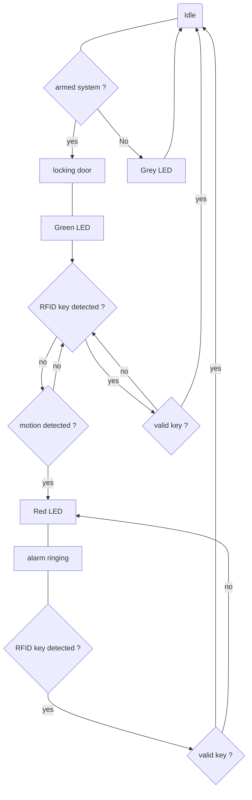

# homealarm_nodered

```mermaid
graph TD
init(Idle)
init---status{armed system ?}
status-->|yes|lock[locking door]---arled[Green LED]
-->rfid{RFID key detected ?}
status-->|No|idleled[Grey LED]-->init
rfid-->|no|motion{motion detected ?}
rfid-->|yes|rfidTrue{valid key ?}
rfidTrue-->|no|rfid
rfidTrue-->|yes|init
motion-->|no|rfid
motion-->|yes|intled[Red LED]---buzz[alarm ringing]
buzz---intrfid{RFID key detected ? }
intrfid-->|yes|intrfidTrue{valid key ?}
intrfidTrue-->|yes|init
intrfidTrue-->|no|intled
```