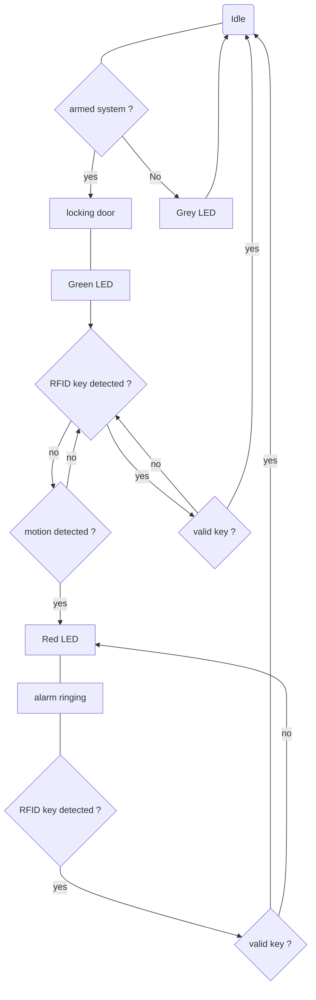

# Home Alarm System 

An university-issued Node-Red-based security system project, integrating MQTT-linked sensors and actuators, MySQL logging and a built-in dashboard.

## Features

### Built-in Dashboard
* manage remote system arming & disarming 
* manually configure new RFID credentials
* monitor latest login attempts, past intrusion and overall system status

### Live Logging
* MySQL database communication using the StackHero node 
* actively records every events and taken actions, as well as system status change in dedicated database tables

### MQTT perception layer-to-backend bidirectional communication 
*The framework involves several MQTT topics respectively destined to a specific sensor that shall emit on it, or actuator that shall listen to it*
#### Sensors topics
`home/alarmsystem/sensors/...`
* `...rfid`     : RFID key reader
* `...PIR`      : Motion detection device
* `...opendoor` : door limit switch
#### Actuators topics 
`home/alarmsystem/actuators/...`
* `...lock`     : physical door lock
* `...screen`   : status displaying screen 
* `...buzz`     : the alarm itself 
* `...led`      : status LED light

## How to run 

### Prerequisites 

Node-Red-only dry run : 

* Node-Red software
* MySQL/MariaDB database engine

Full-stack execution :

| Physical run | Virtual run | 
| :--- | :--- |
| MQTT Broker | MQTT Broker |
| Microcontroler | MQTT Client|
| Listed hardware | |

*This project was made using XAMPP for database hosting and a university-provided Mosquitto broker.*

### Procedure

* Start the Node-Red and database engine instances
* Setup the database using the .sql file 
* Open the node-red interface at **127.0.0.1:1880/**
* Import the .json file & deploy 
* Start the built-in dashboard at **127.0.0.1:1880/ui/**
* Ensure the MQTT Broker is up 
* Run either the hardware or the MQTT client if used
## Logic Diagram (v1)
